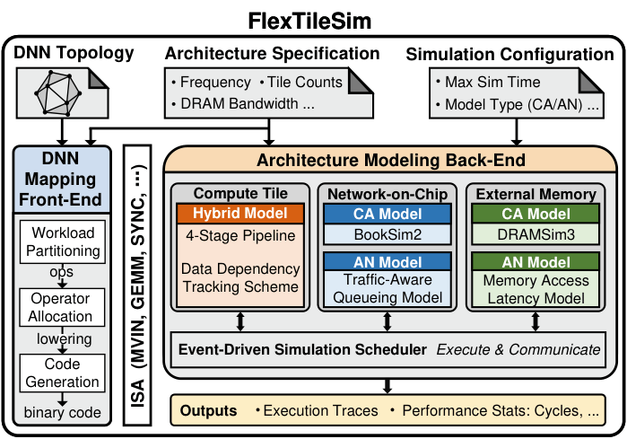

# FlexTileSim

FlexTileSim is a performance simulation framework designed for fast and flexible system-level evaluation of tiled DNN accelerator (or multi-core neural processing units (NPUs)). The framework consists of a front-end and a back-end, as shown in the following figure.

<p align="center">
  
</p>

<p align="center">
  <em>FlexTileSim Framework Overview</em>
</p>

The front-end performs DNN workload partitioning, operator allocation, and executable code generation. The back-end models tiled accelerator architectures composed of multiple compute tiles interconnected by a Network-on-Chip (NoC) and shared off-chip memory.

FlexTileSim is developed to support end-to-end simulation of DNN workloads with configurable architectural parameters and multiple simulation fidelity levels.

The simulator provides two key capabilities:

- Multi-fidelity system simulation

- Online traffic-aware analytical NoC modeling

These features enable efficient exploration of design trade-offs across different architectural scales and modeling accuracy requirements.

## 1. Key Feature

### **1.1 Multi-Fidelity Simulation**

FlexTileSim allows flexible configuration of modeling fidelity for key subsystems:

**Compute Tile**: models the architecture of a classic DNN accelerator, such as Huawei Ascend-class NPU and Google Coral NPU.

Each tile contains:

- 4-stage instruction pipeline (Fetch, Decode, Issue, Execute)
- DMA engine
- Compute engine (CE): Systolic array, vector unit, etc.
- Scoreboard mechanism tracking data dependencies between data movement instructions and computation instructions

**NoC**: Two modeling modes are supported:

- Detailed Mode - Based on Booksim2; Cycle-accurate network simulation
- Analytical Mode - Based on a traffic-aware G/G/1 queueing models

**DRAM**: Two DRAM modeling options:

- Detailed Mode - Based on DRAMSim3; Cycle-accurate memory access simulation
- Analytical Mode - Configurable latency/bandwidth model

This design allows users to trade simulation accuracy and runtime depending on the research scenario.

Example use cases:

- Detailed microarchitecture analysis
- Large-scale architecture design space exploration
- Fast DNN mapping evaluation (e.g., Multi-Tenant)

### **1.2 Traffic-aware NoC Analytical Model**

A major challenge in analytical NoC modeling for tiled DNN accelerators is that traffic patterns in DNN workloads vary dynamically during execution. Prior analytical models based on queueing theory that usually assumes steady Poisson distribution and poses limitations on adaptability to such traffic variations.

To this end, FlexTileSim introduces an online traffic-aware NoC analytical model, which:

- Continuously samples network traffic

- Dynamically updates analytical parameters during simulation to estimate arrival rate and service time more accurately

Morever, the analytical NoC model can be seemlessly integrated to the system due to an event-driven simulation scheduler.This creates a closed-loop full-system simulation framework and enabling adaptive modeling of network behavior as workload traffic evolves.

## 2. Repository Structure

```text
FlexTileSim/
│
├── benchmarks/
│   Front-end DNN mapping tools and precompiled workload binaries.
├── config/
│   Example simulation configuration files.
├── external/
│   Modified third-party tools used by the simulator:
│     - DRAMSim3
│     - BookSim2
├── include/
│   Header files of the simulator.
├── src/
│   Main simulator source code.
├── log/
│   Simulation logs and execution traces generated during runtime.
├── Env.cfg
│   Environment setup script that must be sourced before running the simulator.
├── Makefile
    Build and execution configuration.
```

## 3. Environment Setup

The back-end is developed in C++17. GCC compiler is required.

- gcc >= 9.3.1
- g++ >= 9.3.1

Python is required for front-end workload preparation.

- Python >= 3.6.8

FlexTileSim includes modified versions of ```DRAMSim3``` and ```Booksim2```

These modules will be compiled automatically during the build process.

## 4. Quick Start

FlexTileSim has been tested on ```CentOS 7```. Other Linux distributions may work but have not been fully tested.

### Step 1: Source environment

Every time a new terminal is opened, initialize the environment:

```bash
source Env.cfg
```

### Step 2: Build simulator

Compile the simulator:

```bash
make build
```

The simulator binary will be generated:
```build/npu_sim```

### Step 3: Run example simulation

Run the built-in example:

```bash
make run
```

This command executes a precompiled AlexNet Conv3 layer on a 2-tile system configuration, which serves as a quick sanity test to ensure the simulator is functioning correctly.

### Other commands

Build Booksim only:

```base
make booksim
```

Clean build files:

```bash
make clean
```

or clean all library dependencies

```bash
make distclean
```

## 5. Input and Output

### 5.1 Simulation Input

The simulator requires a configuration file describing the system architecture and simulation parameters.

Example configuration:

```text
config/alexnet_conv3_cfg.txt
```

The configuration specifies:

- Core architecture parameters

- NoC configuration

- DRAM configuration

- Simulation parameters

- Workload instruction file

### 5.2 Simulation Output

After simulation completes, the terminal prints summary statistics as follows:

```text
Simulation Statistics:

Simulation time: 3.88 s
Maximum cycle limit: 1000000
Early termination: Yes
Total cycles: 522649
Total instructions: 20882
IPS: 5388.83
```

Where IPS (Instructions Per Second) reflects the simulation speed across different modeling fidelity and DNN workloads

### Execution Trace (Optional)

Simulation traces can be enabled in the configuration file:

```text
enable_log = 1
log_dir = ./log
log_file = log.log
```

Example trace output:

```text
Initializing FlexNPUSim Simulator...

Creating Detailed Cores...
Loaded 8 instructions for core 0
Loaded 8 instructions for core 1

Creating Analytical DDR...
DDR Frequency: 3.2 GHz

Creating Detailed NoC...
Mesh Size: 2 x 2

Starting Simulation...
[Tick 0-CoreCycle 0] Core 0 Fetch ...
[Tick 100-CoreCycle 1] Core 0 Decode ...
```

These traces provide fine-grained visibility of simulator behavior, including:

- instruction execution

- NoC activity

- DRAM accesses

- cycle-level events

## 6. Simulation Configuration

FlexTileSim uses a configuration file to specify architectural parameters.

The configuration is divided into four sections.

### Compute Tile

Key parameters:

- core_num: number of compute tiles

- npu_freq: Compute tile frequency (GHz)

- systolic_array_size: dimension of the systolic array (e.g., 16x16)

### NoC

- noc_mode: model fidelity; 0 -> detailed NoC (BookSim2); 1 -> analytical model
- noc_freq: NoC frequency (GHz)

### DRAM

- ddr_mode: model fidelity; 0 -> detailed NoC (DRAMSim3); 1 -> analytical model

- ddr_bandwidth:  DRAM bandwidth (GB/s); only valid in analytical mode

### Simulation Parameters

Important options:

- max_sim_cycle: maximum allowed simulation cycles

- inst_file: workload instruction binary

- enable_log: enable detailed execution traces
